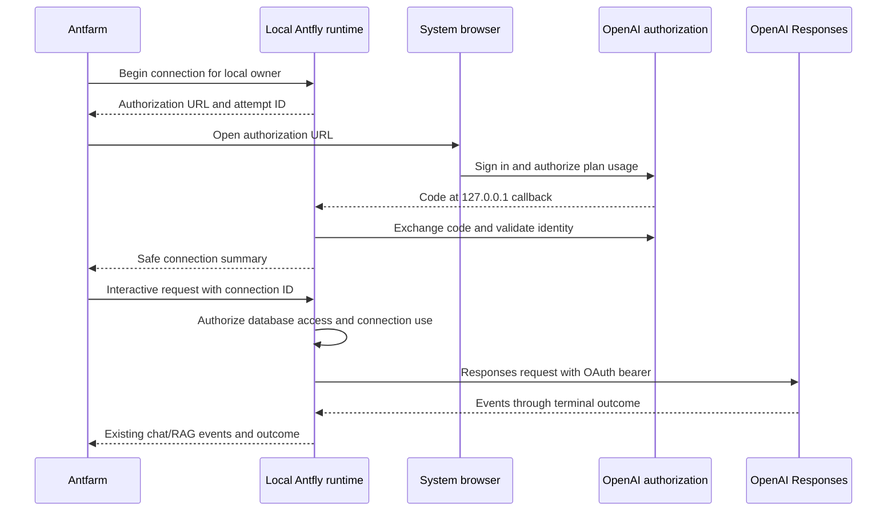

# ChatGPT plan integration for Antfly and Antfarm

Status: local standalone implementation (delivery phases 1–3). Research baseline:
October 5, 2026. Local CLI login is included. Remote VM credential transfer and
commercial hosted identity remain separate later phases.

## Decision

Start with a personal ChatGPT inference connection in locally hosted Antfly,
configured through Antfarm or the CLI. A user connects an eligible ChatGPT plan and selects
it as the generator for interactive chat and retrieval answers. Antfarm supplies
the interface; the Antfly runtime owns OAuth, credentials, model discovery, and
Responses API execution.

ELv2 eligibility is accepted for this design, as confirmed by the project owner.
It is not an implementation blocker. Commercial hosted availability remains a
separate product consideration.

There are two independent capabilities:

| Capability | Purpose | Delivery |
| --- | --- | --- |
| Connect a ChatGPT plan | Authorize personal AI usage in Antfarm | Implement first for local standalone |
| Sign into Antfarm with ChatGPT | Establish an Antfly application account/session | Later hosted authentication integration |

Connecting a plan must not grant Antfly database permissions. An authenticated
Antfly principal and a selected ChatGPT inference registration remain separate.
Conversely, signing into Antfly does not authorize use of a ChatGPT plan.

OpenAI currently documents the local/open-source plan route separately from
commercial identity sign-in and paid/remotely hosted offerings. Neither identity
nor plan authorization provides access to ChatGPT conversations. See the
[quickstart](https://developers.openai.com/siwc/quickstart) and
[plan-usage overview](https://developers.openai.com/siwc/token-sharing-open-source).

## Scope and first user experience

The first release supports bundled Antfarm with a local standalone Antfly runtime.
Users can connect, choose a model, run chat and RAG, reconnect, and disconnect.
Initial credentials and inference stay on the user's machine. Add support for
personally self-hosted remote runtimes in a subsequent phase.

Expose a personal connection section on Connections and an entry in the generator
picker:

> **Use your ChatGPT plan**
>
> Connect your account to power chat and answers over your Antfly data.
>
> **Continue with ChatGPT**

After authorization, show the active account and stable registration label,
available models, connection status, and Disconnect. Confirm first-time plan use;
display **Using ChatGPT plan** beside the selected generator and link **Manage
usage** to ChatGPT settings. Explain that Antfly sends the prompt and selected
retrieved context to OpenAI. Keep account linking distinct from database login.

Use the approved button label and assets, following OpenAI's
[UI/UX guidelines](https://developers.openai.com/siwc/ui-ux-guidelines).

Keep embeddings, reranking, transcription, indexing, scheduled evaluations, and
unattended ingestion on their existing providers in the first release. A personal
plan connection is available only to explicitly initiated interactive generation.
Do not accept it as a table's durable background-generation configuration.

## Existing integration points

Paths below are relative to the repository root.

| Existing code | Planned change |
| --- | --- |
| `ts/apps/antfarm/src/pages/ConnectionsPage.tsx` | Personal ChatGPT connection controls and account selection |
| `ts/apps/antfarm/src/components/generator-preference-provider.tsx` | Persist model and opaque connection selection |
| `ts/apps/antfarm/src/pages/ChatPlaygroundPage.tsx` | Select the connection and display usage/error state |
| `ts/apps/antfarm/src/pages/RagPlaygroundPage.tsx` | Carry the same selection through retrieval and answer generation |
| `zig/pkg/antfly/src/api/connections.zig` | Reuse connection presentation while adding personal ownership |
| `zig/lib/generating/src/mod.zig` | Add a ChatGPT generator mode and connection reference |
| `zig/pkg/antfly/src/generating/mod.zig` | Resolve authorized credentials and instantiate the adapter |
| `zig/pkg/antfly/src/inference/openai.zig` | Reference existing message/result abstractions; retain its current API-key behavior |
| `zig/pkg/antfly/src/api/retrieval_agent.zig` | Translate the existing local tool loop through the new adapter |

Antfarm currently persists complete generator configuration in localStorage. Its
AuthProvider also stores basic-login credentials there. Neither is suitable for
ChatGPT tokens. Add a separate connection context that exposes safe summaries;
do not extend `antfly_auth` with OAuth credentials.

The existing OpenAI provider uses `/chat/completions`, expects a completed JSON
response, and emits Chat Completions message/tool structures. Replacing its API
key with an OAuth token is insufficient.

## Runtime architecture



Use a runtime-owned registration manager and a dedicated `chatgpt` generator
mode backed by a Responses transport. Separate credential lifecycle from inference
so renewal, account switching, CLI sign-in, and remote import can reuse it.

Prefer direct Responses integration over embedding Codex app-server: Antfly
already supplies retrieval orchestration, tools, cancellation, and API results.
Introducing another agent runtime would add lifecycle and history responsibilities
without a necessary role in this design.

### Ownership and proposed API contract

The following names are proposed Antfly interfaces, not existing endpoints or
OpenAI routes. Place them under the same public API prefix as Connections.

| Operation | Proposed route | Safe result |
| --- | --- | --- |
| Start sign-in | `POST /connections/chatgpt/authorize` | Attempt ID, authorization URL, expiry |
| Observe sign-in | `GET /connections/chatgpt/attempts/{id}` | Pending, connected, declined, expired, or error |
| List registrations | `GET /connections/chatgpt/accounts` | Owned connection summaries |
| List usable models | `GET /connections/{id}/chatgpt/models` | Account-specific picker entries |
| End session | `POST /connections/{id}/chatgpt/disconnect` | Local and remote revocation outcome |

Every management operation checks the local owner or authenticated principal.
Starting an attempt is a mutation with CSRF/origin protection. Attempt IDs are
short-lived and owner-bound; they do not authorize inference. Provide a separately
bound loopback listener for the OpenAI callback, rather than an unauthenticated
callback on the general public server. Expire transactions and close listeners
on completion, cancellation, or timeout.

Represent generation selection as an opaque `connection_id` plus model and
provider, adding it to the authoritative API schema and regenerating bindings.
The factory resolves ownership and scope before obtaining a credential lease.
Requests cannot supply an arbitrary URL for this provider or ask it to emit
credentials. Bind the destination to OpenAI's documented API origin.

In single-user local mode, bind the connection to the runtime's local owner.
Do not expose the feature in an unauthenticated network-accessible deployment.
An authenticated multi-user runtime must partition registration visibility and
use by principal. Selection is immutable for a request: an account switch affects
future requests, never an already-running tool loop. Disconnect cancels active
work using that registration and prevents new credential leases.

Personal grants are excluded from cluster-wide connection enumeration, replication,
table metadata, exported configuration, and normal database backups. Worker
execution needs an explicit credential boundary before distributed support ships;
the first release keeps ChatGPT execution in the local runtime.

### Registration and credential lifecycle

Follow the documented
[registration flow](https://developers.openai.com/siwc/token-sharing-open-source/sign-in):

- Persist a stable host ID. Initial authorization uses `dynamic_agent_client` and
  the app name; retain the issued client ID for later sign-ins.
- Use fresh state, nonce, and S256 PKCE; start an HTTP `127.0.0.1` callback listener
  first. Preserve the exact callback URI for code exchange. Only its port may
  change between sign-ins.
- Request `openid profile email offline_access resource.invoke
  chatgpt.tokens.use.direct` with resource `https://api.openai.com/v1`.
- Validate callback state, exchange with the issued client ID, and verify ID-token
  signature, issuer, audience, expiration, and nonce.
- Check granted scopes before enabling plan inference. Publish a registration only
  after identity validation; reauthorization must match its saved identity.

Store issuer, subject, issued client ID, granted scopes, expiry, and tokens in a
protected runtime record. Associate registrations with their Antfly owner; email
is display information and cannot uniquely identify a workspace registration.
Keep host identity separate from account identity.

Use atomic owner-only credential files in the local runtime directory, or an
equivalent protected store. Keep bearer material out of browser storage and
diagnostics. Return authorization URLs with an email login hint only; ID tokens
are not included in browser-visible authorization URLs. Serialize refresh
per registration, replacing rotating tokens together. Refresh near expiry and
revoke renewable sessions on disconnect. Preserve the registration mapping after
sign-out. Temporary outages must not erase credentials. See
[accounts and sessions](https://developers.openai.com/siwc/token-sharing-open-source/profiles-and-sessions).

## Responses adapter contract

Use the selected registration's token for account-specific model discovery and
`POST https://api.openai.com/v1/responses`. Map returned display names and slugs
into Antfarm's model picker; invalidate the catalog when account selection changes.
Every inference request uses `store: false`, `stream: true`, and an input array.
Consume SSE through the terminal event, translating text, tool arguments, usage,
and outcomes into Antfly abstractions. Completion requires `response.completed`;
failure, incompleteness, cancellation, and a truncated stream remain distinct.
See [models and inference](https://developers.openai.com/siwc/token-sharing-open-source/models-and-inference).

Required translation behavior:

- Convert system instructions to supported instructions/developer input.
- Carry conversation context locally and supply required history on each request.
- Translate function definitions into supported namespaced/custom-tool structures.
  Preserve call IDs, arguments, and tool outputs across retrieval-agent iterations.
- Execute database retrieval tools in Antfly under the original authenticated
  principal. Model-generated arguments cannot select another principal or token.
- Propagate existing request deadlines and cancellation into HTTP and tool work.
- If an existing caller expects a completed `GenerateResult`, accumulate SSE
  internally and return only after a successful terminal outcome. Preserve failure
  details even if partial text has already reached Antfarm.

Do not forward unsupported generator settings such as temperature, top-p, or
output-token limits to this route. Disable those controls for the ChatGPT provider
and reject explicit unsupported values. Antfly's existing default token cap needs
a provider-aware policy: enforce supported local duration/byte/iteration limits,
and do not claim they are an equivalent upstream token cap.

Omit HTTP continuation IDs and unsupported hosted tools. Antfly's own retrieval
tools provide the RAG path. Limit the initial UI to text; additional input types
require model capability checks and adapter validation. Audio/transcription and
several hosted tools are outside the documented route. The precise contract is in
[preview limitations](https://developers.openai.com/siwc/token-sharing-open-source/preview-limitations).

### Failure and billing behavior

Preserve safe HTTP status, structured error code, request ID, and retry hints.
Handle both admission errors and errors arriving after streaming begins.

| Outcome | Antfarm behavior |
| --- | --- |
| Consent declined or plan scope absent | Keep plan inference disabled; allow reconnect or another provider |
| User/workspace ineligible | Explain the restriction without an OAuth retry loop |
| Plan/app usage limit | Pause, preserve the draft and partial outcome, link Manage usage |
| Temporary usage or network outage | Preserve credentials; bounded retry when appropriate |
| Terminal refresh failure or confirmed revocation | Require reconnect with the saved registration |
| Unsupported request capability | Report configuration failure; do not repeat the same body |

Never silently fall back to an API key, paid provider, or another person's plan.
Exclude ChatGPT requests from automatic provider-chain fallback unless the user
explicitly selects a billing policy that permits it. Avoid replaying a partially
completed generation automatically. See
[errors and recovery](https://developers.openai.com/siwc/token-sharing-open-source/errors-and-recovery).

## Later deployment modes

For a personally self-hosted VM, the browser's loopback callback reaches the user's
computer. Local CLI sign-in uses the running local runtime. Later add protected
import/export using the same tool and registration; transfer credentials over SSH and preserve the VM's own host ID.
Do not invent a public web callback for the dynamic local flow. See
[self-hosted VMs](https://developers.openai.com/siwc/token-sharing-open-source/self-hosted-vms).

Hosted Antfarm identity sign-in belongs at the authentication gateway. Use
OpenID Connect with PKCE, explicit linking to existing Antfly accounts, secure
application sessions, and existing organization/SSO policy. The gateway may issue
Antfly trusted-principal tokens with local permissions; OpenAI identity tokens
are not Antfly authorization tokens. The existing boundary is described in
[`docs/auth.md`](../docs/auth.md).

This later phase replaces the relevant hosted browser credential flow and keeps
identity consent separate from optional plan consent. Availability requires the
appropriate commercial client registration. Follow the
[website integration](https://developers.openai.com/siwc/website).

## Delivery and validation

1. **Local lifecycle:** registration manager, owner-bound management endpoints,
   credential storage, model discovery, refresh, disconnect, and mock auth tests.
2. **Chat:** Responses adapter, provider/schema changes, Antfarm connection UI and
   generator selection, terminal-stream and cancellation tests.
3. **RAG:** translate retrieval tools and history; verify database authorization
   and that one registration is used throughout each request.
4. **Self-hosted remote:** protected credential transfer, VM host identity, deployment controls.
5. **Hosted product:** identity/session integration and separately approved plan
   usage, with tenant ownership and distributed credential handling designed first.

Before phases 1–3 are considered complete, test callback replay/state mismatch,
PKCE/nonce/audience failures, wrong-account reauthorization, denied plan consent,
cross-owner access, atomic storage and concurrent refresh, reconnect/disconnect,
account-specific model catalogs, SSE chunk boundaries and terminal failures,
tool-call round trips, cancellation, usage-limit errors after partial output,
and prevention of implicit paid fallback. Verify secrets are absent from public
responses, browser persistence, logs, and configuration exports.

Run the existing relevant Zig generation/retrieval and Antfarm checks after
implementation. Finish with a manual eligible-account smoke test covering restart,
token renewal, chat, RAG, and revocation in ChatGPT settings. Automated CI uses
mock endpoints and must not depend on a personal subscription.

The implementation should recheck the referenced OpenAI contracts before coding:
the preview can evolve. Endpoint names and module boundaries proposed here can
change during implementation while preserving ownership, credential isolation,
explicit billing selection, and terminal-stream correctness.

## Implementation notes

The implementation uses `zig/pkg/antfly/src/chatgpt/{protocol,manager,responses}.zig`.
The protocol module implements public-client PKCE and pinned OIDC verification;
the manager owns local registrations, callback listeners and token rotation;
the Responses adapter implements inference and local tool continuation. The
shared generation library carries only an opaque connection reference and
provider-neutral messages/results. Encrypted Responses reasoning items stay in
bounded request history for tool continuation and never enter browser storage.

The standalone runtime enables personal connections only when its public listener
binds to `127.0.0.1`, `::1`, or `localhost`. Serve the bundled Antfarm from that same
origin. Basic-auth users own separate registrations; when database auth is
disabled there is one local owner. API keys, internal service identities, remote
origins and replicated provider configuration cannot consume a personal grant.
Existing database authorization still applies to every retrieval operation.

Management endpoints under the public API base are:

| Method | Path | Result |
| --- | --- | --- |
| POST | `/connections/chatgpt/authorize` | Begin new or selected-registration authorization |
| GET | `/connections/chatgpt/attempts/{attempt_id}` | Owner-bound, expiring outcome |
| GET | `/connections/chatgpt/accounts` | Safe account summaries |
| GET | `/connections/{connection_id}/chatgpt/models` | Account-specific public model catalog |
| POST | `/connections/{connection_id}/chatgpt/disconnect` | Durable local disable and best-effort remote revocation |

Local CLI commands use the same owner-bound runtime endpoints and credential
manager as Antfarm; the CLI never creates a second OAuth store:

```sh
antfly connections login chatgpt
antfly connections login chatgpt --no-browser
antfly connections login chatgpt --connection-id <id>
antfly connections list chatgpt
antfly connections models chatgpt <id>
antfly connections logout chatgpt <id>
```

Start the local standalone server first. Set `ANTFLY_URL` for a different local
port. Authenticated servers require `ANTFLY_USERNAME` and `ANTFLY_PASSWORD`;
unset `ANTFLY_TOKEN`, since API-key/service identities cannot own personal grants.
Credentials are environment inputs rather than process arguments. Conflicting
bearer/Basic configuration and incomplete Basic credentials are rejected.
`--no-browser` prints the pinned OpenAI authorization URL to stderr for manual
opening on the same machine. Login polls the expiring attempt for at most 600
seconds (`--timeout` accepts 1–600); only a connected outcome succeeds. Safe
JSON results go to stdout, with no token export. Commands disable transport
retries, redirects and cookies and bound individual responses and requests.

`connections` is the namespace for provider grants, separate from Antfly user
identity/permissions under `auth`. Additional providers can define their own
scopes and authentication mechanisms (including non-browser methods); Google,
AWS and Antfly Cloud inference are not implemented here. Neither the CLI nor
HTTP management API exposes credential import/export. Remote URLs are rejected.

The later VM flow is local browser authorization followed by protected transfer
of a selected registration over SSH. A VM must persist its own stable host ID
before import and retain it; copying the laptop's entire store would incorrectly
copy its host identity. The VM then owns refreshes. OpenAI currently does not
provide host-specific attribution or revocation for transferred sessions. This
is a future feature, not enabled by `ANTFLY_URL` or `--no-browser`. See the
[self-hosted VM contract](https://developers.openai.com/siwc/token-sharing-open-source/self-hosted-vms).

The registry lives in `<auth_store_root_dir>/chatgpt/accounts.json` with mode
0600 inside a 0700 directory. A process lock prevents multiple runtimes sharing
that credential store. Updates use an exclusive temporary file, file sync,
rename and directory sync. Disconnect and reauthorization increment a session
version; request-long account pins and token leases prevent a tool loop from
switching accounts or resuming after disconnect/reconnect. Authorization attempts
also capture the selected account version. Disconnect declines pending sign-ins
for that registration and unselected attempts for the same owner, so delayed
callbacks cannot restore a grant; a new sign-in after disconnect remains allowed. Refresh is serialized
and rotating tokens are saved before inference proceeds.

Generation configuration is `{provider: "chatgpt", connection_id, model}` with
optional model-supported `reasoning_effort`. Explicit API credentials, custom
origins, sampling/output-token parameters, rate-limit overrides, automatic
retries and mixed-provider fallback chains are rejected. The adapter enforces
local deadline, response-size and conversation/tool budgets. It requires a valid
terminal `response.completed` frame before returning a successful result, and
reports quota failures arriving after upstream deltas. Safe upstream status,
code, parameter, request ID and numeric retry hints remain request-scoped.

Antfarm Connections owns authorization and disconnect controls; Chat and RAG
selectors show eligible accounts and catalog model slugs. Browser state contains
safe summaries, models and opaque references. Switching the application user or
API endpoint aborts previous operations and clears account/catalog state.
Catalog versions are tracked per account. Disconnect invalidates only that
account’s pending catalog results; discarded requests cannot block a newer fetch.
Reauthorization reloads the connected account’s catalog. Other generation pickers do not
offer personal plans for durable or unattended work.

Automated tests use public signed JWT fixtures and a loopback mock auth server.
They cover signature/audience/nonce/expiry, callback state and owner isolation,
issued-client reuse and changed-subject rejection, concurrent refresh rotation,
persistence/restart, disconnect cancellation, stream truncation and midstream
quota failures, tool history, SDK transport and frontend ownership cleanup.
A live eligible-account smoke test is still required before release: connect,
restart, renew tokens, run chat and RAG, revoke in ChatGPT settings, then reconnect.
No personal subscription or credentials are used in automated verification.

Validated in the implementation worktree: `zig build antfly-generating-test
lib-generating-test antfly -j2` (217 runtime and 13 library tests), Zig OpenAPI
consistency check, retrieval regression suite, TypeScript SDK build/type checks
and 399 tests, Antfarm build
and 164 unit tests, Go SDK tests, Python generation consistency and 257 tests.
A local standalone HTTP smoke test verified safe summaries, origin rejection,
authorization startup, PKCE parameters and a declined loopback callback. The
repository-wide license check reports pre-existing missing/stale headers; the
new ChatGPT Zig modules use the repository ELv2 header.

Local CLI validation: `zig build antfly-cmd-test antfly-client-test antfly -j2`
passed (91 command tests and 6 client tests, no leaks). A mock-runtime binary
smoke test verified pending/connected/declined login, list/models/logout, Basic
auth, no authorization replay or redirect, safe failure output and unsupported
provider/path rejection. The CLI help and shell completion registry include the
new commands. VM import/export was intentionally deferred.

Review regressions cover delayed callbacks after logout, stale authorization
pins, owner isolation, explicit reconnect, unrelated account catalog fetches,
replacement request ownership, catalog refresh after reauthorization and owner
changes during sign-in refresh. Saved model selections wait for account discovery
and reload after API scope changes. Authorization startup allocates its response
before launching tasks; allocation-failure coverage checks that no attempt remains
registered and all response memory is released. The
218 runtime/generation tests and 165 Antfarm tests pass; Antfarm builds successfully.
