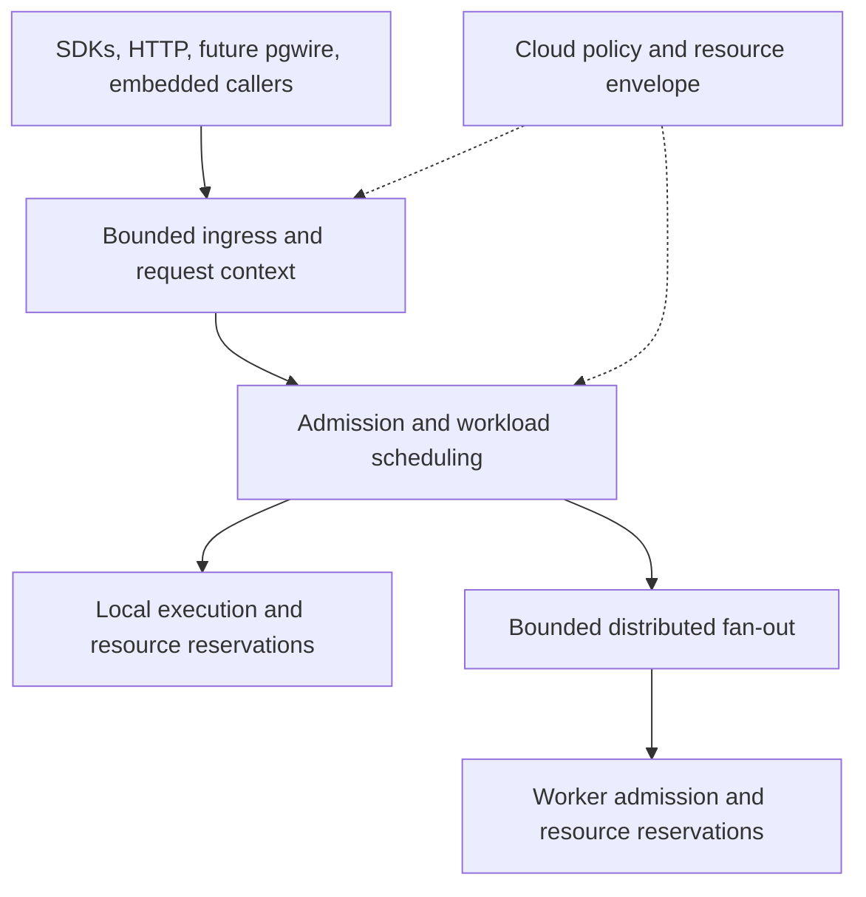

# Workload Admission and Scheduling

Status: proposed design; implementation has not started.

Source baseline: `22b167264a` on `origin/main`.

Development branch: `codex/workload-scheduling`, in
`.worktrees/workload-scheduling`.

## Decision

Build a transport-independent workload admission system inside Antfly. Separate
cheap outstanding requests from expensive active execution. Absorb brief bursts
with short, bounded waiting; isolate workload classes; enforce resource budgets
on every execution node. Cloud configures the resource envelope and customer
policy while the engine owns scheduling and resource safety.

The customer contract is predictable behavior: brief bursts complete smoothly,
expensive queries cannot monopolize the database, and sustained overload produces
an understandable response. Local, self-hosted, and Cloud deployments use the
same engine mechanisms.

Connection reuse, HTTP multiplexing, and future pgwire support all feed this
system. An idle connection does not reserve query execution capacity. Clients
should not need a separate connection-pooler deployment to obtain these semantics.

## Goals and boundaries

- Maintain useful throughput and bounded memory under overload.
- Protect interactive latency while allowing analytical, write, and background
  workloads to make measurable progress.
- Bound waiting by count, retained bytes, and time.
- Preserve one request deadline and cancellation lineage across all stages.
- Account for parallel helpers and distributed fan-out, not just public requests.
- Provide useful automatic defaults with explicit, observable overrides.
- Make overload reasons, queue time, and execution time visible to clients and
  operators.

This project does not add a SQL dialect, pgwire compatibility, a billing system,
or a general durable job service. It does not change consistency, search effort,
recall, or durability to reduce load. It does not promise that increasing admitted
concurrency increases throughput. Long-running asynchronous jobs can use the
same execution policies, but their durable lifecycle is a separate feature.

## Current behavior and integration points

These are existing mechanisms, not descriptions of the proposed end state:

| Surface | Current responsibility | Planned integration |
| --- | --- | --- |
| [common/request_admission.zig](pkg/antfly/src/common/request_admission.zig) | Process-local fail-fast counters and single-release leases | Preserve the cheap fast path and extend admission with bounded waiting and explicit outcomes |
| [common/config.zig](pkg/antfly/src/common/config.zig) | Query/write/inference admission configuration; query default 32 | Preserve existing explicit configuration semantics during migration |
| [api/request_admission_policy.zig](pkg/antfly/src/api/request_admission_policy.zig) | Exhaustive mapping from public operations to admission classes | Keep the exhaustive route audit; add workload classification separately |
| [api/httpx_handler.zig](pkg/antfly/src/api/httpx_handler.zig) | Public-operation leases, overload responses, separate streaming-body admission | Integrate deadlines, queue ownership, disconnect handling, and structured errors |
| [common/http/std_http_listener.zig](pkg/antfly/src/common/http/std_http_listener.zig) | Alternate HTTP listener and transport safeguards | Apply the same admission contract through its supported routes |
| [storage/admission_waiter.zig](pkg/antfly/src/storage/admission_waiter.zig) | Intrusive waiters and cancellation-safe admission handoff | Reuse proven lifetime mechanics; add policy at the owning scheduler |
| [storage/dense_work_admission.zig](pkg/antfly/src/storage/dense_work_admission.zig) | FIFO rerank admission and nonblocking helper admission | Integrate resource accounting and avoid duplicate waiting policies |
| [storage/resource_manager.zig](pkg/antfly/src/storage/resource_manager.zig) | Memory slices, reservations, pressure, and dense resource admission | Remain the authority for actual resource reservations |
| [storage/db/types.zig](pkg/antfly/src/storage/db/types.zig) | Request deadlines and cancellation | Carry scheduling context through execution boundaries without losing controls |
| [api/local_query_contract.zig](pkg/antfly/src/api/local_query_contract.zig) | Internal query serialization | Preserve scheduling semantics and validate internal-only controls |
| [serverless/api/http_handler.zig](pkg/antfly/src/serverless/api/http_handler.zig) | Serverless foreground admission | Use the same contract with deployment-specific resource policy |

The existing public query gate rejects additional requests when its configured
capacity is occupied. It does not wait for capacity. Lower-level execution can
already wait for resources, so adding a public FIFO alone would create another
waiting layer without making the whole system fair or observable.

The observed C30/C40 benchmark boundary is consistent with a default capacity of
32, but original response bodies are required to attribute those failures. That
observation is motivation for better admission behavior, not a capacity-sizing
measurement or a reason to choose a universal replacement value.

## Ownership and topology

Each node protects its own resources. A coordinator controls request lifetime,
fan-out, and retained merge state; it cannot grant permission to exceed a worker's
resource limits. Embedded and internal callers enter through equivalent resource
admission paths. They cannot bypass execution accounting by avoiding HTTP.

There is one coherent policy and accounting model, with enforcement at the owner
of each resource. This is not a single cluster-wide lock or a centralized
per-query scheduling RPC. Keep the uncontended path allocation-free where the
existing request representation permits it. Never hold a scheduler mutex while
doing I/O, executing a query, invoking callbacks, or waking arbitrary user code.

## Three distinct budgets

### Ingress and outstanding requests

Bound connections/streams, body bytes, parsing memory, and outstanding requests.
Authenticate and establish a server-bounded deadline before expensive work, while
retaining a cheap pre-authentication transport/body limit. Authentication itself
must not be an unbounded bypass.

An HTTP body or vector payload can be large before a plan exists. Reserve bytes
before retaining them; charge decoded expansion and request metadata as well.
For streaming bodies, release transport-stage reservations only when ownership
has transferred to an accounted request representation. A request must never
fall between accounting domains during that transition.

Outstanding admission covers request lifetime, including queued and executing
states. It is distinct from active execution capacity. Requests rejected here
do not enter the execution scheduler.

Enforce the process envelope and protected class budgets together. Reserve
outstanding counts, request/queue bytes, minimum execution working sets, and
retained-output/state capacity for latency-sensitive work and essential progress.
An execution-slot reserve alone is insufficient: bulk requests and slow consumers
must not exhaust the earlier admission stages or the memory needed to use it.
These are partitions within the same hard resource envelope, not additional
unaccounted capacity. Charge each allocation once while checking both its class
allowance and the process total.

Before trustworthy classification, charge requests to a bounded ingress/planning
pool. Provide a small protected path only for server-verifiable bounded operations;
an arbitrary client hint cannot access it. Expensive parsing or planning must not
consume that protected path. Other interactive requests remain subject to this
shared ingress bound; the latency guarantee applies only to work whose bounded
path has been verified.

Protect a nonborrowable floor at every stage. Permit borrowing only from capacity
above those floors. Reclaim borrowed queue capacity by retiring eligible excess
waiters under the documented overload policy; do not revoke live memory or
pretend that a slow output stream releases bytes immediately. Outstanding and
retained-state borrowing is bounded by lifetime/idle limits and cannot consume
another class's protected floor. Slow-consumer caps apply within the originating
class, including the interactive class. Reserve a separate bounded control path
for cancellation, cleanup, and recovery so a full data-request envelope cannot
prevent work from releasing resources.

### Waiting

Bound queued requests by both number and retained bytes. Every waiter also has a
maximum admission wait. A queue ends at whichever limit is reached first; memory
pressure can reject work even when count capacity remains.

Queued requests retain compact owned request state and necessary authorization
context. They do not acquire query execution scratch, storage snapshots, locks,
or large result buffers merely to wait. This rule concerns first admission;
suspended continuations may retain explicitly accounted state as described below.
Necessary planning has its own bounded allocation/execution allowance. If
classification requires a plan, perform that
bounded planning stage before entering the final execution queue.

Wait asynchronously through the runtime; do not dedicate an OS thread per
waiter. Pending callbacks and borrowed cancellation sources must remain valid
until the admission owner has acknowledged retirement.

### Active execution and retained state

Use active execution limits together with hard memory reservations and relevant
I/O/concurrency limits. A count is a safety bound, not a claim that all queries
have equal cost. Parallel helpers consume the same node resource envelope as
their parent. A helper that cannot obtain capacity runs serially where supported
or is omitted without changing query semantics; it must not deadlock its parent.

Track execution separately from result streaming. A slow reader may retain result
buffers or a cursor, but should not retain a CPU permit when no computation is
running. Apply output-byte limits, backpressure, and stream idle timeouts. If a
stream holds a snapshot, continue accounting for that snapshot until it closes.

## Lease ownership, lifecycle, and cancellation

Use distinct lease types; an ambiguous single "execution permit" is insufficient:

| Lease | What it bounds | Release condition |
| --- | --- | --- |
| Request lifetime | Outstanding count and owned request state at its admission scope | All owned local work and cleanup have ended; session state has transferred to a separately accounted owner |
| Queue membership | Waiting count and retained queue metadata | Grant, expiry, rejection, or acknowledged cancellation |
| Runnable execution | Active local computation, including individually charged helpers | The task reaches a verified quiescent suspend point or finishes |
| Retained state | Working memory, snapshots, merge/output buffers, transaction/cursor state | Actual destruction or atomic transfer to another accounted owner |
| Local I/O or provider work | Local transport buffers, outstanding I/O, or inference at the relevant scope | Actual local completion or acknowledged cancellation; closing a connection does not retire remote work |
| Remote attempt | A possibly executing child operation at its destination | Verified terminal outcome or verified fencing and quiescence; uncertainty transfers to a bounded destination ledger |

Request/state byte reservations survive queue-to-execution transitions. Queue
accounting references those bytes without charging them twice. A continuation's
existing state remains charged when it rejoins a runnable queue.

The normal lifecycle is:

`received -> ingress admitted -> queued -> runnable -> draining -> completed`

Runnable work can transition through
`runnable -> suspended -> resume queued -> runnable`. Suspension releases only
the runnable lease, after the task has stopped computing and transferred ownership
to a continuation. Retained state and outstanding I/O remain charged. Wakeup
queues the continuation; it never resumes computation directly on an I/O callback
without reacquiring a runnable lease. Small admission/cleanup callbacks use their
own bounded control allowance.

Output draining may suspend and resume the same way. A helper that is still
running retains its own runnable lease even if its parent is suspended. Operators
without a verified suspend boundary retain runnable admission until they finish;
class limits must account for that behavior.

Ingress rejection and queued cancellation can complete after retiring their
reservations. Execution failure or cancellation enters draining, which joins
remaining work and performs required cleanup before completion. A client-visible
error is not proof that underlying work or a committed write has stopped.

Required invariants:

1. Queue insertion atomically charges its count and byte reservations.
2. Grant transfers queue ownership to a runnable lease exactly once, reserving
   the initial working set or the continuation's required incremental bundle.
3. A grant racing cancellation either retires the waiter or returns the granted
   capacity exactly once. No code touches a waiter after its lifetime handoff.
4. Runnable permits remain held until their tasks stop computing at verified
   suspend/completion boundaries. State and I/O leases remain held until their
   resources are actually released, irrespective of the client response.
5. Every error path releases each owned lease exactly once. Counters never go
   negative, and reservations reconcile after quiescence.
6. Expired queued client work never starts or resumes. Check deadlines at each
   handoff; required cleanup and irrevocable write completion use their separately
   accounted owners and progress paths described below.
7. Shutdown stops new admission, retires queued work, and drains/cancels active
   client work under a bounded shutdown deadline. Mandatory recovery obligations
   survive shutdown through the existing durable recovery protocol.

Use the existing lease and waiter conventions where possible. Do not introduce
an unrelated cancellation framework for this feature.

The implementation must provide an ownership table for each integrated operator
and a state-transition test before enabling its suspend/resume behavior. Establish
these lease types and invariants before implementing the first public queue.

### Irrevocable writes and recovery ownership

The client deadline bounds cancellable work and how long the caller waits. It
cannot revoke a durable commit decision or discard required commit propagation.
Identify that boundary for each write path using its existing transaction
protocol. Before crossing it, reserve bounded completion/recovery capacity and
persist the information required for recovery. If that capacity is unavailable,
apply backpressure before the irrevocable decision.

After that boundary, client expiry, disconnect, and shutdown transfer required
completion to a recovery owner. Transfer retained state and outstanding attempts
atomically, without releasing their charges or creating a second logical write.
Preserve the original transaction identity, fencing, and idempotent replay
semantics in the existing [transaction recovery machinery](pkg/antfly/src/api/transactions.zig).
No recovery action receives a fresh client request identity or an unlimited
execution lease. Optional response construction can stop; mandatory work proceeds
under bounded recovery concurrency with its own retry policy and progress reserve.

Bound the durable recovery backlog as well as its in-memory working set. A full
backlog stops new writes before their irrevocable boundary; it never drops an
existing obligation. Recovered obligations reacquire memory and execution capacity
in bounded batches. If shutdown cannot finish them, retain the durable handoff
for restart or another fenced owner before releasing process-local state. Report
an uncertain client outcome conservatively; recovery completion is independent
of whether the caller remains connected.

## Deadlines and distributed execution

Queue wait, planning, execution, remote calls, and inference all consume the same
end-to-end budget. Maximum admission wait is additionally bounded:

`admission wait <= min(configured wait ceiling, remaining request budget)`

Locally, use monotonic deadlines. Never serialize a process-local monotonic
timestamp as though another machine shared its clock. Define a versioned wire
budget contract: forward the remaining duration, subtract measured elapsed time
on subsequent sends/retries, and derive a local deadline at the receiver. The
coordinator retains its authoritative deadline and cancels children on expiry.
Document network-delay uncertainty rather than claiming that duration forwarding
alone guarantees simultaneous expiry on every node.

The coordinator limits concurrent shard tasks and accounts for merge buffers.
Workers independently admit the resulting tasks. Trusted internal task context
identifies the parent and workload class; public clients cannot forge it. Charge
one public request at ingress and actual execution at workers, without treating
internal child tasks as new customer API requests.

Bounded worker waiting may be necessary, but it shares the deadline and reports
its wait separately. Do not repeatedly requeue at gateway, coordinator, and
worker with fresh timeouts. A coordinator awaiting remote work holds only its
accounted coordinator state, not an idle CPU execution permit.

On partial fan-out failure, cancel unnecessary siblings and follow the existing
result-completeness contract. Admission must not silently return partial results.
Retry only when operation semantics permit it, inside one bounded retry budget.
Topology changes and retries cannot reset resource charges or execution timeouts.

### Remote attempts under network failure

Give each logical operation and each distinct attempt an identity, including a
fenced coordinator generation. Deduplicate retransmissions of the same attempt;
any new attempt consumes capacity even if an earlier attempt's outcome is unknown.
Workers enforce a local expiry covering queueing and execution, check cancellation
at verified boundaries, and bound the interval to quiescence. Operators without
that bound cannot rely on expiry as proof of released capacity. Irrevocable writes
follow the recovery ownership rules above.

On transport failure or lost cancellation acknowledgement, release local transport
resources only after local teardown. Atomically transfer the remote-attempt charge
and minimal reconciliation state to a count/byte-bounded uncertainty ledger for
the destination. Reserve ledger capacity before dispatch so this transfer cannot
fail during cleanup. The client request can then retire its local state without
pretending the remote operation stopped. The worker retains its own actual resource
charges until quiescence or transfer to recovery.

Uncertain attempts consume the destination's outstanding-attempt allowance.
Retries, including retries elsewhere, count alongside them against a bounded
aggregate attempt budget. Exhaustion stops dispatch to the affected destination
and bounds total speculative work; it must not pin ordinary local request slots
or prevent unrelated healthy destinations from using their own capacity.

Reconcile using terminal attempt status or a worker acknowledgement that the old
generation is fenced and its cancellable work has quiesced. Fencing must also
reject delayed dispatches from that generation. Worker-local expiry alone does
not tell the coordinator when a delayed request arrived: never retire uncertainty
solely because a sender-side timer elapsed. Late responses reconcile by attempt
identity exactly once and cannot revive a retired client request. Retain bounded
generation metadata so duplicate responses cannot recreate ownership.

Coordinator restart must recover the uncertainty ledger or reconcile/fence its
previous generation before issuing replacement work; a restart cannot reset the
attempt budget. Permanent loss requires authoritative worker-incarnation fencing
or termination evidence, not a health-check failure. Integrate this with existing
membership and transaction recovery; unsupported peers retain conservative
accounting rather than silently claiming the stronger guarantees.

## Resource acquisition and deadlock prevention

Publish a resource acquisition order before integrating each execution path.
The initial model is outstanding request reservation, then execution admission
with minimum working-set reservation, then bounded operator-specific resources.
Acquire the initial execution/reservation bundle without sleeping while holding
a partially acquired bundle. Roll it back if the bundle cannot be granted.

Resume admission requests only incremental resources beyond already charged
continuation state. Bound aggregate suspended state and reserve continuation/
cleanup progress capacity within the process envelope. Do not allow new starts
to consume resources reserved for existing work to resume and retire. These
reservations must cover the verified minimum completion/cleanup path; operators
that cannot supply such a bound must retain admission, spill safely, or fail
before consuming it. Resource-manager pressure relief and cleanup cannot depend
on obtaining an ordinary foreground slot.

### Requests that do not fit

Reject a request immediately when its minimum bundle exceeds a per-request hard
ceiling or the maximum bundle its eligible class can ever obtain under the
current policy. Return a structured resource limit reason. Reevaluate feasibility
after policy reductions; never leave an impossible request at the head of a queue.

For temporarily unavailable resources, allow bounded backfilling within a class:
examine only a bounded number of subsequent entries and admit a fitting request
against the same class deficit and resource ceilings. Track the bypass count and
age of the blocked head. FIFO is the default ordering, not a requirement to leave
usable resources idle indefinitely.

After the bypass count or age threshold, designate the oldest feasible blocked
request as the class's next large admission. Stop new starts and borrowing that
would consume the resources needed for its minimum bundle. Existing work drains,
and resumes/cleanup retain their progress reservations. Keep this as an admission
barrier; do not hold a partially acquired resource bundle while waiting. Admit
the request atomically once the full bundle fits, or retire it on cancellation,
deadline, or a policy change that makes it impossible. Other classes keep their
protected capacity. This bounds bypass by younger arrivals; it cannot promise
admission before a deadline when existing retained resources do not become free.

Use a deterministic order among competing large-admission barriers to avoid
conflicting resource claims. Test shared-resource cases, including memory plus
I/O capacity, rather than assuming each scalar limiter can decide independently.

Memory remains governed by the resource manager. Unknown or underestimated work
must request additional reservations before allocating. If growth cannot be
granted, yield/spill/restart only where the operator supports those semantics;
otherwise return a resource-exhausted error. Do not wait indefinitely for growth
while every active task holds memory needed by the others.

Existing transactions may legitimately retain locks or snapshots between
statements. Account for that retained state separately, enforce idle/lifetime
limits, and retain storage deadlock detection. Workload scheduling cannot promise
to eliminate transactional deadlocks.

## Workload classes and fairness

Preserve the current query/write/inference API admission categories. Add a
separate execution policy rather than reinterpreting those enum values as a
complete workload taxonomy.

Initial execution classes are interactive reads, analytical reads, foreground
writes, and background maintenance. Inference has its own scarce-resource
admission; waiting for inference does not occupy a database CPU slot. Replication,
recovery, and essential control work have bounded reserved capacity.

Begin with explicit trusted classification and a small number of conservative
rules. Ordinary reads enter the interactive policy, which has separate bounded
and general lanes. Only server-verified bounded plans can use the protected
low-latency lane. Wide graph traversals, aggregations, scans, and unknown-cost
plans use the general lane or the analytical class regardless of client hints.
Give general/non-yielding work a concurrency sublimit that cannot consume the
protected bounded-query capacity, including the corresponding memory and queue
floors. Declared analytical work and background jobs use their own classes.

Within interactive work, schedule both lanes with explicit shares and age-based
progress. A verified cooperative operator receives a bounded execution quantum;
when it exhausts that quantum, it saves accounted continuation state and rejoins
the appropriate runnable queue. Demote work exceeding the bounded-plan estimate
at its next verified yield point, carrying its measured work debt forward.
Unverified or non-yielding operators cannot enter the protected lane based only
on an optimistic cost estimate. Maintain an operator inventory recording
cancellation checkpoints, resumability, maximum verified non-yielding work, and
minimum continuation resources before enabling this policy for each operator.

Demotion is an atomic accounting transition at a verified yield boundary. Transfer
request, queue, retained-memory/snapshot, and outstanding-attempt charges as well
as measured scheduling debt. Global charges remain unchanged; destination lane
capacity must be available before its counters take ownership. Still-running
helpers retain their runnable leases until quiescence, and no continuation runs
under a new lane while retaining the old lane's protected allocation.

Reserve a bounded transition allowance within the process envelope before admitting
demotable work to the protected lane. It must cover that operator's maximum
verified retained state and minimum cleanup resources; growth requires additional
credits before allocation. If the general lane cannot accept a demotion, transfer
ownership to this allowance, release the protected lane's charges, and suspend
there for a bounded interval. Transition entries have their own count/byte caps
and cannot execute ordinary work or borrow the protected lane's reserve. These
credits reserve capacity, not duplicate allocations or double-counted live bytes.

On expiry of that interval, spill only where safe and separately accounted, or
cancel through the bounded cleanup path. Mandatory write completion instead
transfers to its reserved recovery owner. Do not leave expensive work charged to
the protected lane indefinitely or overfill the destination. Cancellation racing
demotion must select exactly one owner. An operator without verified transfer and
cleanup bounds belongs in the general lane from initial admission.

On a resource envelope too small to reserve concurrent execution for both lanes,
provide isolation only through verified cooperative quanta. If an operator cannot
yield within that bound, constrain its admission and explicitly exclude overlapping
low-latency guarantees while it runs. Do not claim that class weights alone
preempt running work. Hard resource ceilings continue to apply in every lane.

Use weighted deficit scheduling between classes and the interactive lanes, with
FIFO ordering subject to the bounded-backfill rule above. Charge bounded estimated
work and reconcile against measured work so underestimated expensive requests do
not repeatedly obtain unfair service.
Deficit arithmetic and retained debt must be bounded. Add aging so a continuously
eligible class makes progress, while retaining memory and execution ceilings.

Allow classes to borrow unused capacity above the protected floors. Because
running work is not instantly preemptible, borrowed execution capacity is reclaimed
at cooperative yield/completion boundaries. Protect an interactive reserve and
bound non-yielding work intervals;
do not promise low latency if all execution slots can be occupied indefinitely
by borrowed long-running tasks. Likewise reserve progress for required writes
and maintenance so reads cannot prevent ingestion, compaction, or recovery.

Fairness below a class is keyed to an authenticated workload/account policy when
needed. Do not use raw API keys as an unlimited source of scheduling identities.
Bound scheduler identity cardinality and expire inactive state. A dedicated
deployment need not pay for a distributed tenant scheduler to execute each query.

## Transport, SDKs, and session state

HTTP, future pgwire, and embedded calls produce the same internal request context:
deadline/cancellation, trusted workload classification, admission identity, and
resource ownership. Keep protocol adapters small; scheduling semantics belong in
the engine.

Connections and streams have transport limits independent of execution. SDKs
reuse connections and bound outstanding operations with deadline-aware waiting.
Client limits reduce avoidable overload but are not authoritative: many client
processes can collectively exceed node capacity.

Transactions and cursors use explicit state reservations and idle timeouts.
An idle transaction does not automatically own a CPU permit. Streaming resumes
execution only through the appropriate admission boundary. Protocol-specific
state affinity must not turn every idle connection into reserved execution.

Cancellation is best effort after execution begins. A disconnected write may
have committed; do not return an error that implies it was definitely unexecuted.
SDKs may retry reads subject to their consistency contract and writes only with
an established safe retry/idempotency contract. Socket flow control alone does
not provide query cancellation or execution admission.

## Configuration and default selection

Keep `admission.query.max_concurrent_requests` and the equivalent write/inference
settings compatible during initial rollout. Their explicit values continue to
bound active admitted operations as documented. Preserve legacy zero as disabling
that gate; it does not disable memory or transport safety. Do not silently change
zero to mean automatic sizing.

Proposed configuration concepts, not currently supported field names:

| Concept | Semantics |
| --- | --- |
| Outstanding request count/bytes | Hard process envelope across queued and active requests |
| Queue count/bytes | Hard retained-waiting bounds |
| Admission wait ceiling | Maximum wait within the original request deadline; zero means fail fast |
| Execution sizing mode | Explicit fixed or automatic mode; distinct from unlimited legacy configuration |
| Execution floor/ceiling | Validated adaptive bounds within resource capacity |
| Class/lane shares and reserves | Protected count, byte, and execution floors at each admission stage, plus bounded borrowing |
| Large-admission policy | Bounded backfill scans, bypass count/age, and deterministic admission barriers |
| Execution quanta | Verified cooperative work bounds and general/non-yielding concurrency sublimits |
| Request/stream/session ceilings | Finite server limits on duration and retained state |

Finalize names in the canonical configuration schema and generate bindings before
shipping them. Reject contradictory configurations. Expose configured and
effective values plus the policy version. A limit reduction stops new grants
until usage falls below the new limit; it does not revoke live allocations.
Explicit queue-policy reductions retire excess queued work with clear outcomes.

Roll out with fixed execution limits and opt-in bounded waiting. Choose eventual
defaults from qualification across supported deployment sizes; this document
does not nominate a new universal value in place of 32. Automatic initial sizing
uses allocated CPU and memory, including container limits, with conservative
fallbacks when detection is unavailable. Queue sizes follow a short waiting-time
target and retained-byte ceiling, not an arbitrary large backlog.

Only introduce adaptive execution sizing after fixed-mode telemetry and fairness
are reliable. Adjust slowly within hard bounds using completed work, execution
latency, CPU throttling, and memory/I/O pressure. Track queue time separately;
queue growth alone is not evidence that more execution would help. Require
hysteresis, bounded step sizes, a minimum observation window, and a stable
fallback when samples are missing or the workload changes. Do not automatically
increase concurrency to compensate for a slow external provider.

## Cloud responsibilities

Cloud applies the purchased resource envelope, customer policy, and deployment
configuration. Dedicated instance throughput should primarily follow provisioned
resources. Optional per-key limits protect customer applications; abuse controls
protect the shared edge. Neither is a substitute for engine resource admission.

The gateway should forward promptly after its own bounded policy checks. Avoid a
large database-work queue at the edge. Preserve deadlines, cancellation, request
IDs, overload reasons, and safe retry semantics across proxy hops.

Contractual account-wide limits must not multiply with gateway replica count.
Use coordinated accounting or bounded leased allocations for those limits;
document consistency and failure behavior. Keep process-local safety limits for
protecting each replica. The engine execution scheduler should not require a
synchronous Cloud control-plane call per query.

Cloud displays effective capacity, queue wait, execution latency, and the limiting
resource. Capacity recommendations and autoscaling use sustained pressure,
topology, and customer spending limits. They do not promise to rescue a brief
burst. Scale-down drains admitted work, and recovery headroom remains part of the
resource envelope.

## Errors and observability

Introduce structured stable reasons while maintaining existing status-code
compatibility during rollout:

| Condition | Proposed public behavior |
| --- | --- |
| Customer/key policy limit | 429 with `rate_limited` and a retry window when known |
| Node admission full or admission wait ceiling reached | 429 with `instance_busy`, distinct subreason, and bounded retry guidance |
| End-to-end deadline expired | Existing timeout status convention with `deadline_exceeded`; identify the stage |
| Backend unavailable/draining | 503 with `backend_unavailable` or `draining` |
| Per-request hard resource ceiling | Structured `resource_exhausted`; do not suggest a retry will necessarily help |

Expose whether execution started where it is known. Preserve ambiguous outcomes
for writes and identify retryability conservatively. Do not manufacture an exact
retry time from uncertain queue estimates. Errors and logs must not expose other
customers' workload identities.

Metrics include outstanding/queued/active counts, queued and retained bytes,
admission wait histograms, execution histograms, cancellations by stage, rejection
reasons, configured/effective budgets, class service shares, and limiting-resource
pressure. Keep label cardinality bounded; use traces or controlled diagnostic
views for individual requests and customer attribution.

Include uncertain-attempt count/bytes and age, fenced destinations, recovery
backlog and oldest obligation age, and demotion transfer/wait/cleanup outcomes.
Distinguish client retirement from underlying work quiescence and durable recovery
completion so timeouts cannot hide accumulated work.

Profiles distinguish admission wait, resource wait, planning, execution, remote
wait, inference wait, and output drain. Concurrent child durations can overlap:
report wall-clock critical-path timing separately from aggregate worker time.
Extend existing admission metrics without silently changing their meaning.

## Implementation sequence

Each phase must be independently reviewable and preserve a rollback mode.

### Prerequisite: ownership and progress model

- [ ] Specify distinct request, queue, runnable, retained-state, and I/O/provider
  leases and ownership transitions, including suspension, resume, and draining.
- [ ] Inventory operator yield/cancellation boundaries and continuation resource
  needs; identify paths that must retain runnable admission.
- [ ] Specify protected budgets at ingress, planning, queueing, execution, and
  retained-state stages, including bounded control/cleanup progress.
- [ ] Define resource-fit decisions, bounded backfill, large-admission barriers,
  and policy-change behavior; model-test progress with retained continuations.
- [ ] Specify attempt identity, expiry, fencing, uncertainty budgets, and restart
  reconciliation; separate local transport teardown from remote retirement.
- [ ] Identify each write path's irrevocable boundary and bounded durable recovery
  handoff; specify atomic lane transfer and demotion fallback ownership.

Complete this model before adding the first public queue. A Phase 1 operator may
retain its existing coarse execution lease until Phase 2 integrates suspension,
but its ownership and limitations must already conform to the model. Phase 1
does not claim the full within-class latency isolation delivered by Phase 2.

### Phase 1: bounded waiting and lifetime correctness

- [ ] Audit every public, internal, embedded, and serverless entry path and every
  existing queue; record its owner, accounting, deadline, and acquisition order.
- [ ] Implement the prerequisite ownership model's admission outcome and context,
  queue byte ownership, and grant/cancel state machine for the initial paths.
- [ ] Extend the existing admission/waiter machinery with count/byte bounds,
  asynchronous waiting, deadlines, cancellation, draining, and metrics.
- [ ] Integrate opt-in query waiting at public handlers, preserving legacy
  fail-fast behavior and independent transport/body limits.
- [ ] Enforce protected admission count/byte floors, slow-consumer caps, impossible
  bundle rejection, and bounded backfill for the integrated paths.
- [ ] Add canonical configuration and structured overload responses, then
  propagate them through SDKs and Cloud-facing contracts.

### Phase 2: execution isolation and distributed accounting

- [ ] Integrate operator suspension/resumption using the prerequisite lease model,
  separating outstanding/coordinator lifetime from runnable execution.
- [ ] Connect resource-manager reservations and existing dense admission to the
  common policy; eliminate redundant unaccounted waiting.
- [ ] Implement class and interactive-lane shares, general-work sublimits,
  cooperative quanta, atomic demotion with reserved transition capacity, bounded
  borrowing, and starvation checks.
- [ ] Bound helper parallelism, shard fan-out, and merge buffers; implement the
  versioned remaining-budget wire contract, worker cancellation/expiry, and bounded
  uncertainty reconciliation with generation fencing.
- [ ] Account for output streaming, cursors, and retained transaction state.
- [ ] Integrate irrevocable write handoff and durable recovery backlog admission
  with the existing transaction protocol, including restart and shutdown.
- [ ] Ensure control, replication, recovery, and background progress under load.

### Phase 3: defaults, SDK experience, and Cloud operation

- [ ] Qualify fixed policies on supported resource envelopes and choose initial
  automatic sizing and bounded-wait defaults from measurements.
- [ ] Ship reusable SDK clients with bounded local waiting and safe retries.
- [ ] Expose effective policy and limiting-resource diagnostics in Cloud.
- [ ] Add adaptive execution tuning behind an explicit mode, with hysteresis
  and fallback; qualify it against fixed-mode baselines.
- [ ] Integrate sustained-pressure capacity recommendations and bounded scaling.

## Validation and release gates

Use deterministic VOPR/modelled-I/O tests for state transitions, virtual time,
grant/cancel races, shutdown, and distributed failure schedules. Use real runtime
tests to verify asynchronous waits, disconnect propagation, and transport behavior.

Required correctness cases include allocation failure during enqueue, queue-byte
exhaustion, deadline/grant races, cancellation after grant, nested resource growth,
partial fan-out failure, helper starvation, policy reduction while busy, restart,
and drain. Assert no double release, use-after-free, late queued execution, leaked
reservations, or unbounded queue/task growth. Verify all supported frontends
observe the same resource policy and cannot spoof internal scheduling identity.

Add deterministic scenarios for the isolation, ownership, and progress requirements:

- Saturate bulk outstanding counts, queued bytes, and slow-consumer state while
  verifying that bounded interactive work and cleanup retain their reserved path.
- Suspend every active task on I/O with retained state, queue new work, then wake
  continuations; assert safe reacquisition, no uncharged callback execution, and
  completion without resource-acquisition deadlock. Race cancellation at each
  suspend/resume handoff, including still-running helpers.
- Flood ordinary interactive reads with expensive graph/aggregation requests
  while issuing bounded lookups; verify general-lane limits, quantum/demotion
  behavior, and bounded-lane progress, including the smallest resource envelope.
- Put impossible and temporarily blocked large requests at the queue head with
  fitting smaller requests behind them. Verify immediate impossible rejection,
  bounded bypass, large-admission progress after existing work drains, other-class
  progress, and correct retirement on deadline or policy reduction.
- Partition a worker, lose cancellation acknowledgements, delay dispatch beyond
  the sender deadline, and restart the coordinator. Verify bounded uncertainty,
  retry accounting, worker expiry, generation fencing, and progress at healthy
  destinations. Deliver late/duplicate replies and reconcile exactly once; a
  timer or health-check failure alone must not retire a remote charge.
- Expire or disconnect the client and initiate shutdown immediately after a
  durable commit decision. Verify durable recovery with the original transaction
  identity, bounded replay, and no lost obligation or duplicate logical write.
  Exhaust recovery capacity and verify backpressure before new commit decisions.
- Demote underestimated work while the general lane is full, including retained
  snapshots, helpers, and remote attempts. Race cancellation with transfer; assert
  single ownership, unchanged global charges, bounded transition residence and
  cleanup, preserved recovery obligations, and protected-lane progress.

Performance qualification must cover small and large supported machines, warm and
cold data, mixed cheap/expensive queries, mixed reads/writes, background maintenance,
slow output consumers, and slow inference. Sweep offered concurrency through and
beyond saturation, including C1/5/10/20/30/40/60/80 for continuity with existing
benchmarks. Include both closed-loop concurrency tests and controlled open-loop
arrival tests so client slowdown does not hide overload.

Compare identical query semantics and recall settings. Count retries and failures;
measure latency from original submission, including waiting and retries. Record
CPU/memory limits, effective admission policy, offered/completed rate, p50/p95/p99
queue and end-to-end latency, memory peak, class progress, rejection reasons, and
recovery time after overload ends. Admission-only changes must not alter results.

Before implementation rollout, record numerical latency, memory, throughput, and
recovery thresholds for each release workload. Do not pick thresholds after
seeing results. The release gate requires bounded resource usage, preserved
low-load behavior within the declared regression allowance, fair progress under
sustained load, useful completed throughput, and prompt return to normal after
overload. Adaptive mode must meet the same gates against the fixed baseline.

## Decisions intentionally left for qualification

- Exact automatic execution formulas and waiting-time defaults.
- Numerical class/lane shares, protected reserves, backfill thresholds, and
  verified cooperative yield intervals; the isolation/progress rules are fixed.
- Cost estimates for vector, full-text, graph, and aggregation work.
- Concrete wire encoding for deadlines and rolling-upgrade fallback behavior.
- The point at which long-running workloads should move to explicit job APIs.

These do not change the architectural invariants above. Implement fixed,
observable mechanisms first, then choose and tune policy from retained evidence.
